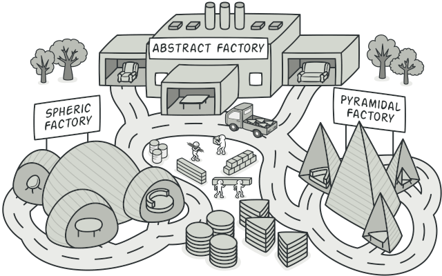
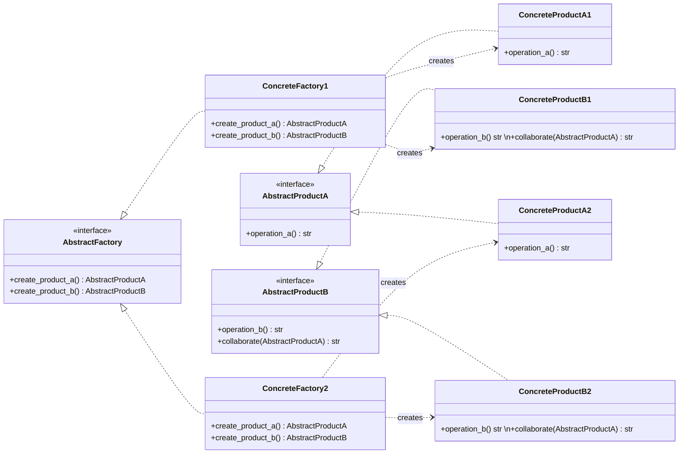

# Abstract Factory

The **Abstract Factory** pattern provides an interface for creating families of related or dependent objects without specifying their concrete classes.



## Introduction

Imagine a codebase where a high-level component creates UI widgets — buttons, checkboxes, dropdowns — by directly instantiating platform-specific classes.

> **How do you ensure that all widgets belong to the same platform family, and how do you swap the entire family without scattering `if/else` checks across your application?**

Hardcoding concrete widget classes means that adding a new platform (or switching to a different theme) forces changes in every place an object is created. Worse, mixing widgets from different families is possible at compile time but broken at runtime.

The **Abstract Factory** pattern solves this by grouping the creation of related objects behind a single interface. The factory guarantees that every object it produces belongs to the same family. Client code only talks to the abstract factory and the abstract product interfaces, so swapping an entire family is a matter of changing which factory is injected.

This separates _which family to create_ from _how those objects are used_, leaving consistency guarantees inside the factory rather than scattered across client code.

## How to recognize an abstract factory pattern implementation?

The **Abstract Factory** pattern can be recognized when a class declares several factory methods — one per product type in a family — and concrete subclasses (or implementations) override all of them together to produce a coordinated set of objects. No single factory method can be swapped independently; the whole factory is replaced.

It differs from **Factory Method**: Factory Method uses inheritance to let subclasses decide what single product to create. Abstract Factory uses composition to let clients choose which full family of products to create by selecting a factory object.

### Real world analogy

Think of an automotive assembly plant with two production lines: a luxury model line and an economy model line. Each line produces an engine, a transmission, and an interior package — engineered as a matched unit. The tolerances, power ratings, and finish specifications are designed to work together. The production scheduler decides which line to run; every component that rolls off that line belongs to its family, and no one reaches across lines mid-build.

## How to know if you can apply the pattern in your project?

An **Abstract Factory** is a good fit when:

- You have families of related objects where mixing products across families would break correctness — the types may allow it at compile time, but the semantics do not.
- You want to switch the entire product family at runtime (or configuration time) without touching the client code.
- You want to enforce constraints — e.g., every UI widget must come from the same platform theme — and catch violations at compile time rather than runtime.

## Key components

The **Abstract Factory** pattern typically involves the following components.

- **Abstract Factory**. An interface that declares creation methods for each distinct product in the family. Each method returns an abstract product type.

- **Concrete Factories**. Implementations of the abstract factory. Each concrete factory corresponds to one product family and creates only the variants belonging to that family.

- **Abstract Products**. Interfaces for each type of product the factory can produce. Client code depends only on these interfaces.

- **Concrete Products**. The actual implementations grouped by family. A concrete factory creates only its own family's concrete products.

- **Client**. Uses the abstract factory and abstract product interfaces exclusively. It is decoupled from any concrete factory or product class.

## Benefits and Trade-offs

- ✓ Guarantees that products from the same factory are compatible with each other.
- ✓ Open/Closed Principle. Introducing a new product family requires adding a new concrete factory without modifying existing code.
- ✓ Single Responsibility Principle. Product creation is centralized inside each concrete factory.
- ✓ Client code references no platform-specific classes — all concrete types are hidden inside the factory.
- ✗ Adding a new product _type_ (a new method on the abstract factory) requires updating every concrete factory, which can be disruptive.
- ✗ Can introduce a large number of classes when there are many product types and families.

## Examples

### Conceptual

A minimal `AbstractFactory` with two creation methods, two concrete factories each producing a coordinated pair of products.



<details markdown="1">
<summary>Show conceptual implementation</summary>

```python
from abc import ABC, abstractmethod


class AbstractProductA(ABC):
    @abstractmethod
    def operation_a(self) -> str: ...


class AbstractProductB(ABC):
    @abstractmethod
    def operation_b(self) -> str: ...

    @abstractmethod
    def collaborate(self, collaborator: AbstractProductA) -> str: ...


class ConcreteProductA1(AbstractProductA):
    def operation_a(self) -> str:
        return "Result from ConcreteProductA1"


class ConcreteProductA2(AbstractProductA):
    def operation_a(self) -> str:
        return "Result from ConcreteProductA2"


class ConcreteProductB1(AbstractProductB):
    def operation_b(self) -> str:
        return "Result from ConcreteProductB1"

    def collaborate(self, collaborator: AbstractProductA) -> str:
        return f"B1 collaborating with ({collaborator.operation_a()})"


class ConcreteProductB2(AbstractProductB):
    def operation_b(self) -> str:
        return "Result from ConcreteProductB2"

    def collaborate(self, collaborator: AbstractProductA) -> str:
        return f"B2 collaborating with ({collaborator.operation_a()})"


class AbstractFactory(ABC):
    @abstractmethod
    def create_product_a(self) -> AbstractProductA: ...

    @abstractmethod
    def create_product_b(self) -> AbstractProductB: ...


class ConcreteFactory1(AbstractFactory):
    def create_product_a(self) -> AbstractProductA:
        return ConcreteProductA1()

    def create_product_b(self) -> AbstractProductB:
        return ConcreteProductB1()


class ConcreteFactory2(AbstractFactory):
    def create_product_a(self) -> AbstractProductA:
        return ConcreteProductA2()

    def create_product_b(self) -> AbstractProductB:
        return ConcreteProductB2()


def client_code(factory: AbstractFactory) -> None:
    product_a = factory.create_product_a()
    product_b = factory.create_product_b()
    print(product_b.operation_b())
    print(product_b.collaborate(product_a))
```

</details>

### Real-world

A cross-platform UI toolkit where `WindowsUIFactory` and `MacOSUIFactory` each produce a coordinated set of `Button` and `Checkbox` widgets. The `Application` class only depends on `UIFactory` and the abstract widget interfaces.

```python
from abc import ABC, abstractmethod
from dataclasses import dataclass


class Button(ABC):
    @abstractmethod
    def render(self) -> str: ...

    @abstractmethod
    def on_click(self) -> str: ...


class Checkbox(ABC):
    @abstractmethod
    def render(self) -> str: ...

    @abstractmethod
    def on_toggle(self) -> str: ...


@dataclass
class WindowsButton(Button):
    label: str

    def render(self) -> str:
        return f"[Windows Button: {self.label}]"

    def on_click(self) -> str:
        return f"Windows button '{self.label}' clicked"


@dataclass
class MacOSButton(Button):
    label: str

    def render(self) -> str:
        return f"(macOS Button: {self.label})"

    def on_click(self) -> str:
        return f"macOS button '{self.label}' clicked"


@dataclass
class WindowsCheckbox(Checkbox):
    label: str

    def render(self) -> str:
        return f"[Windows Checkbox: {self.label}]"

    def on_toggle(self) -> str:
        return f"Windows checkbox '{self.label}' toggled"


@dataclass
class MacOSCheckbox(Checkbox):
    label: str

    def render(self) -> str:
        return f"(macOS Checkbox: {self.label})"

    def on_toggle(self) -> str:
        return f"macOS checkbox '{self.label}' toggled"


class UIFactory(ABC):
    @abstractmethod
    def create_button(self, label: str) -> Button: ...

    @abstractmethod
    def create_checkbox(self, label: str) -> Checkbox: ...


class WindowsUIFactory(UIFactory):
    def create_button(self, label: str) -> Button:
        return WindowsButton(label)

    def create_checkbox(self, label: str) -> Checkbox:
        return WindowsCheckbox(label)


class MacOSUIFactory(UIFactory):
    def create_button(self, label: str) -> Button:
        return MacOSButton(label)

    def create_checkbox(self, label: str) -> Checkbox:
        return MacOSCheckbox(label)


class Application:
    def __init__(self, factory: UIFactory) -> None:
        self._factory = factory
        self._button = factory.create_button("OK")
        self._checkbox = factory.create_checkbox("Accept terms")

    def render(self) -> None:
        print(self._button.render())
        print(self._checkbox.render())

    def interact(self) -> None:
        print(self._button.on_click())
        print(self._checkbox.on_toggle())
```

## References

- 📚 [Abstract Factory — Refactoring Guru](https://refactoring.guru/design-patterns/abstract-factory)
- 📚 [Abstract Factory in Python — Refactoring Guru](https://refactoring.guru/design-patterns/abstract-factory/python/example)
- 📚 [Abstract Factory Design Pattern](https://www.geeksforgeeks.org/system-design/abstract-factory-pattern)
- 📼 [Abstract Factory Pattern – Design Patterns](https://youtu.be/v-GiuMmsXj4)
- 📼 [Abstract Factory Design Pattern Explained in 10 Minutes](https://youtu.be/VCXQCLzJFoE)
