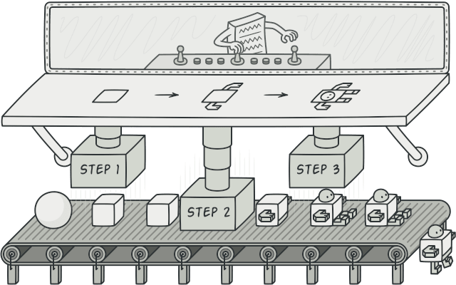
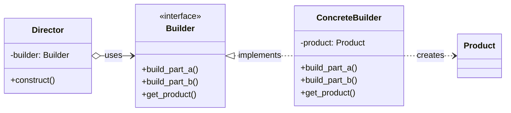

# Builder

The **builder** pattern separates the construction of a complex object from its representation so that the same construction process can create different representations of the object.

It provides an elegant solution to the problem of creating complex objects with multiple components.



## Introduction

Imagine you have a class that includes in its behaviour the creation of a complex object, with various configurations.

> **How this class can be _simplified_?**

The **builder** pattern solves this problem by abstracting the construction process into separate classes, resulting in cleaner and more maintainable code. In other words, applying the pattern means following the _separation of concerns_ principle, separating the construction process from the products internal structure.

Without the **builder** pattern, you might end up with a constructor that takes numerous parameters, leading to confusing and complex code.

Implementing the **builder** pattern keeps encapsulated the code for construction, allowing you to vary a product's internal representation.

The main drawback of the **builder** pattern is that requires creating a concrete builder for each unique configuration of the "product".

## How to recognize a builder pattern implementation?

The **builder** pattern can be recognized in a class, which has a _single creation method_ and _several methods to configure_ the resulting object. **Builder class methods often support chaining**.

The **builder** and factory patterns are very similar in the fact they both instantiate new objects at runtime. The difference is when the process of creating the object is more complex, so rather that the factory returning a new instance of object, it calls the builders director constructor method that goes through a more complex construction process involving several steps. In the end, both return an object instance.

### Real world analogy

Consider a restaurant. The creation of "today's meal" is a factory pattern, because you tell the kitchen "get me today's meal" and the kitchen (factory) decides what object to generate, based on hidden criteria.

The **builder** appears if you order a custom pizza. In this case, the waiter tells the chef (builder) "I need a pizza; add cheese, onions and bacon to it!" Thus, the builder exposes the attributes the generated object should have, but hides how to set them.

## How to know if you can apply the pattern in your project?

A **builder** is useful when constructing an object requires multiple steps, especially when many parameters are involved, some of which may be optional.

In such cases, using a class constructor can become confusing, as handling numerous optional arguments makes it harder to validate the object's state. This increases the risk of creating an instance with an invalid combination of parameters.

The builder pattern addresses this by allowing parameters to be set step by step before returning a fully constructed object. While this approach requires a _concrete builder_ implementation for each parameter combination, it ensures a consistent and valid object representation.

Another advantage of builders is handling complex object initialization, where method calls must follow a specific sequence and intermediate objects need to be generated. Attempting to manage this within a constructor can be a real pain, and relying on a separate initialization method that one must remember to call is error-prone. Delegating construction to a **builder** simplifies this process by ensuring the object transitions through the necessary states in a controlled manner.

## Key components

The **builder** pattern typically involves the following components.

- **Product**. This is the complex object that you want to create. It contains various parts or components, so several representations of this object exists.

- **Builder**. An abstract interface that defines the methods for building each part of the product.

- **Concrete builders**. Concrete classes that implement the builder interface. Each concrete builder is responsible for constructing a specific representation of the product.

- **Director**. Coordinates the construction process using the builder interface. It knows the specific order and combination of steps required to build the product. The Director is only responsible for executing the building steps in a particular sequence. The Director works with any builder instance that the client code passes to it.

> **Strictly speaking, the director class is optional, since the client can control builders directly.**

## Benefits and Trade-offs

- ✓ More control over the construction process compared to other creational patterns.
- ✓ Supports constructing objects step-by-step.
- ✓ Can construct objects that require a complex assembly of sub-objects.
- ✓ Single Responsibility Principle (SRP) - You can isolate complex construction code from the business logic of the product.
- ✗ The overall complexity of the code can increase since the pattern requires creating multiple new classes.

## Examples

### Conceptual

A minimal implementation showing all components — `Product`, `Builder` interface, `ConcreteBuilder`, and `Director`.



<details markdown="1">
<summary>Show conceptual implementation</summary>

```python
from abc import ABC, abstractmethod
from dataclasses import dataclass, field

@dataclass
class Product:
parts: list[str] = field(default_factory=list)

    def add(self, part: str) -> None:
        self.parts.append(part)

class Builder(ABC):
    @property
    @abstractmethod
    def product(self) -> Product: ...

    @abstractmethod
    def produce_part_a(self) -> None: ...

    @abstractmethod
    def produce_part_b(self) -> None: ...

    @abstractmethod
    def produce_part_c(self) -> None: ...

class ConcreteBuilder(Builder):
    _product: Product

    def __init__(self) -> None:
        self.reset()

    def reset(self) -> None:
        self._product = Product()

    @property
    def product(self) -> Product:
        product = self._product
        self.reset()
        return product

    def produce_part_a(self) -> None:
        self._product.add("Part A1")

    def produce_part_b(self) -> None:
        self._product.add("Part B1")

    def produce_part_c(self) -> None:
        self._product.add("Part C1")

@dataclass
class Director:
builder: Builder

    def build_minimal_viable_product(self) -> None:
        self.builder.produce_part_a()

    def build_full_featured_product(self) -> None:
        self.builder.produce_part_a()
        self.builder.produce_part_b()
        self.builder.produce_part_c()

```

</details>

### Real-world

In an event-driven system, every message is wrapped in an _event envelope_: the
payload plus a long tail of optional metadata — correlation and causation IDs for
tracing, schema versions, transport headers. A constructor with all of these as
optional arguments quickly becomes unreadable, and forgetting to propagate a
correlation ID breaks distributed tracing.

`DomainEventBuilder` (internal events) and `IntegrationEventBuilder` (public,
schema-versioned events) build different `Event` envelopes from the same fluent
interface. The `caused_by` step encapsulates a rule that is easy to get wrong by
hand: a follow-up event inherits the prior event's correlation ID. Here the
client drives the builders directly, without a director.

```python
from abc import ABC, abstractmethod
from datetime import UTC, datetime
from enum import StrEnum
from typing import Any, Self
from uuid import UUID, uuid4

from pydantic import BaseModel, Field


class EventType(StrEnum):
    ORDER_PLACED = "OrderPlaced"
    PAYMENT_CAPTURED = "PaymentCaptured"


class Event(BaseModel):
    event_type: EventType
    payload: dict[str, Any]
    event_id: UUID = Field(default_factory=uuid4)
    occurred_at: datetime = Field(default_factory=lambda: datetime.now(UTC))
    source: str
    correlation_id: str | None = None
    causation_id: UUID | None = None
    schema_version: int = 1
    metadata: dict[str, str] = Field(default_factory=dict)

    def __str__(self) -> str:
        return (
            f"{self.event_type} (id={self.event_id}, source={self.source}, "
            f"v{self.schema_version}, correlation={self.correlation_id}, "
            f"causation={self.causation_id}, metadata={self.metadata})"
        )


class EventBuilder(ABC):
    _event: Event

    @property
    def event(self) -> Event:
        return self._event

    def build(self) -> Event:
        return self._event

    @abstractmethod
    def with_metadata(self, key: str, value: str) -> Self: ...

    @abstractmethod
    def correlated_to(self, correlation_id: str) -> Self: ...

    @abstractmethod
    def caused_by(self, prior: Event) -> Self: ...


class DomainEventBuilder(EventBuilder):
    """Builds internal events for a single bounded context."""

    def __init__(self, event_type: EventType, payload: dict[str, Any]) -> None:
        self._event = Event(
            event_type=event_type,
            payload=payload,
            source="orders-service",
        )

    def with_metadata(self, key: str, value: str) -> Self:
        self._event.metadata[key] = value
        return self

    def correlated_to(self, correlation_id: str) -> Self:
        self._event.correlation_id = correlation_id
        return self

    def caused_by(self, prior: Event) -> Self:
        self._event.causation_id = prior.event_id
        self._event.correlation_id = prior.correlation_id
        return self


class IntegrationEventBuilder(EventBuilder):
    """Builds public events shared across services, so a schema version is required."""

    def __init__(
        self, event_type: EventType, payload: dict[str, Any], schema_version: int
    ) -> None:
        self._event = Event(
            event_type=event_type,
            payload=payload,
            source="orders-service.public",
            schema_version=schema_version,
        )
        self._event.metadata["content-type"] = "application/json"

    def with_metadata(self, key: str, value: str) -> Self:
        self._event.metadata[key] = value
        return self

    def correlated_to(self, correlation_id: str) -> Self:
        self._event.correlation_id = correlation_id
        return self

    def caused_by(self, prior: Event) -> Self:
        self._event.causation_id = prior.event_id
        self._event.correlation_id = prior.correlation_id
        return self
```

## References

- 📚 [Design Patterns in Python: Builder](https://medium.com/@amirm.lavasani/design-patterns-in-python-builder-0732552324b1)
- 📚 [Builder in Python](https://refactoring.guru/design-patterns/builder/python/example)
- 📼 [Builder: Design Patterns in Python](https://youtu.be/pMadA6F4zGU)
- 📼 [Builder Design Pattern Explained in 10 Minutes](https://youtu.be/oP76NM4qZhw)
