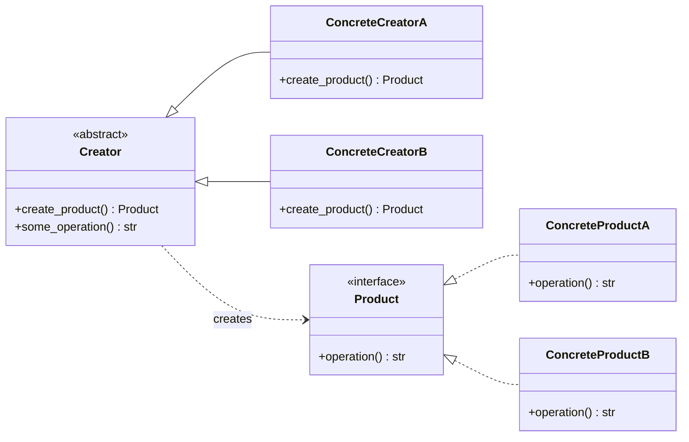

# Factory Method

The **Factory Method** pattern provides an interface for creating objects in a superclass, but allows subclasses to alter the type of objects that will be created. The creation the responsibility is deferred to subclasses.


## Introduction

Imagine a codebase where a high-level component is directly coupled to a specific, concrete implementation class.

> **How do you introduce new, alternative implementation types without rewriting the existing creation code across the application?**

Directly instantiating concrete classes creates a rigid dependency chain. When requirements expand to demand variant behaviors, you are forced to locate and modify every instance where the original object was hardcoded.

The **Factory Method** pattern solves this by replacing direct object instantiation with a call to a special _factory method_. Subclasses override this method to return the concrete type they know about while client code only depends on the shared interface.

This separates the _decision of what to create_ from the _logic that uses what was created_, keeping each class focused on a single responsibility.

## How to recognize a factory method pattern implementation?

The **Factory Method** pattern can be recognized when a base class declares a method whose sole purpose is to return a new object conforming to a specific interface, and subclasses override that method to change the concrete type being returned. The rest of the creator class uses only the common interface, never the concrete product type.

It differs from a plain static factory function: here, inheritance is the mechanism that drives variation, not branching logic inside a single method.

### Real world analogy

Think of a coffee shop. Every drink follows the same routine: grab a cup, pull a shot of espresso, add the milk component, top it off, hand it over. The "milk component" step is left blank in the master routine. The latte station fills it in with steamed milk. The cappuccino station fills it in with foam. The macchiato station fills it in with just a dollop. The customer orders a drink and gets one — they don't care which station made it, and the shop can add a new drink tomorrow without rewriting the whole process.

## How to know if you can apply the pattern in your project?

A **Factory Method** is a good fit when:

- You want a class to delegate the instantiation of its dependencies to subclasses, because it cannot predict the exact class it needs to create.
- You want to centralize creation logic so that when a new variant is needed, only one method needs to change, and none of the usage code does.
- You are managing a pool of reusable resources (connections, workers) where the exact type returned can vary but the lifecycle management stays the same.

## Key components

The **Factory Method** pattern typically involves the following components.

- **Product**. The interface (or abstract class) that defines the contract for all objects the factory method can produce. Client code interacts only with this interface.

- **Concrete Products**. The actual implementations of the product interface. Each represents a distinct variant the system knows how to build.

- **Creator**. An abstract class that declares the factory method. It may also contain a default implementation of the factory method. Importantly, it uses the factory method internally to build and work with products. The creator's business logic never depends on a concrete product class.

- **Concrete Creators**. Subclasses of `Creator` that override the factory method to return a specific `ConcreteProduct`. A concrete creator is the only place that knows which class to instantiate.

## Benefits and Trade-offs

- ✓ Open/Closed Principle. New product types can be introduced by adding new creator subclasses, without touching existing code.
- ✓ Single Responsibility Principle. Product creation logic is centralized in one place.
- ✓ Decouples client code from concrete product classes, reducing coupling.
- ✓ Makes it easy to swap or extend what gets created without changing how it's used.
- ✗ Requires creating a new `ConcreteCreator` subclass for every new product type, which can grow the class hierarchy.

## Examples

### Conceptual

A minimal `Creator` with an abstract `create_product()` factory method, and two concrete creators each returning a different product.



<details markdown="1">
<summary>Show conceptual implementation</summary>

```python
from abc import ABC, abstractmethod


class Product(ABC):
    @abstractmethod
    def operation(self) -> str: ...


class ConcreteProductA(Product):
    def operation(self) -> str:
        return "Result from ConcreteProductA"


class ConcreteProductB(Product):
    def operation(self) -> str:
        return "Result from ConcreteProductB"


class Creator(ABC):
    @abstractmethod
    def create_product(self) -> Product: ...

    def some_operation(self) -> str:
        product = self.create_product()
        return f"Creator working with: {product.operation()}"


class ConcreteCreatorA(Creator):
    def create_product(self) -> Product:
        return ConcreteProductA()


class ConcreteCreatorB(Creator):
    def create_product(self) -> Product:
        return ConcreteProductB()
```

</details>

### Real-world

A notification system where `EmailService`, `SMSService`, and `PushService` each override `create_notification()` to produce the right channel, while the shared `notify()` logic stays in the base class.

```python
from abc import ABC, abstractmethod
from dataclasses import dataclass


class Notification(ABC):
    @abstractmethod
    def send(self, message: str) -> str: ...


@dataclass
class EmailNotification(Notification):
    email: str

    def send(self, message: str) -> str:
        return f"[Email → {self.email}] {message}"


@dataclass
class SMSNotification(Notification):
    phone: str

    def send(self, message: str) -> str:
        return f"[SMS → {self.phone}] {message}"


@dataclass
class PushNotification(Notification):
    device_token: str

    def send(self, message: str) -> str:
        return f"[Push → {self.device_token}] {message}"


class NotificationService(ABC):
    @abstractmethod
    def create_notification(self) -> Notification: ...

    def notify(self, message: str) -> str:
        return self.create_notification().send(message)


class EmailService(NotificationService):
    def __init__(self, email: str) -> None:
        self.email = email

    def create_notification(self) -> Notification:
        return EmailNotification(self.email)


class SMSService(NotificationService):
    def __init__(self, phone: str) -> None:
        self.phone = phone

    def create_notification(self) -> Notification:
        return SMSNotification(self.phone)


class PushService(NotificationService):
    def __init__(self, device_token: str) -> None:
        self.device_token = device_token

    def create_notification(self) -> Notification:
        return PushNotification(self.device_token)
```

## References

- 📚 [Factory Method — Refactoring Guru](https://refactoring.guru/design-patterns/factory-method)
- 📚 [Factory Method in Python — Refactoring Guru](https://refactoring.guru/design-patterns/factory-method/python/example)
- 📚 [Factory method Design Pattern](https://www.geeksforgeeks.org/system-design/factory-method-for-designing-pattern)
- 📼 [Factory Method Pattern – Design Patterns](https://youtu.be/EcFVTgRHJLM)
- 📼 [Factory Method Design Pattern Explained in 10 Minutes](https://youtu.be/s_4ZrtQs8Do)
