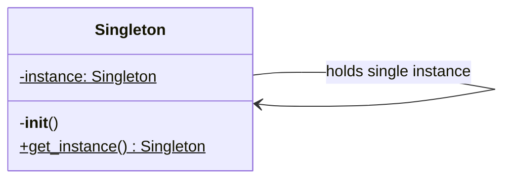

# Singleton

The **Singleton** pattern ensures that only one object of its kind exists and provides a single point of access to it for any other code. For achieving this, you have to restrict the instantiation of a class.


## Introduction

{: .highlight }

> **Why would anyone want to control how many instances a class has?**

The most common reason for this is to control access to some shared resource — for example, a database or a file.

Just like a global variable, the **Singleton** pattern lets you access some object from anywhere in the program. However, it also protects that instance from being overwritten by other code.


## How to recognize a singleton pattern implementation?

The **Singleton** pattern can be implemented following different approaches, but all of them have the following common concepts.

- _Private constructor_ to restrict instantiation of the class from other classes.
- _Private variable of the same class_ that is the only instance of the class.
- _Public static method that returns the instance of the class_. Under the hood, this method calls the private constructor to create an object and saves it in a static field. All following calls to this method return the cached object working as a global access point

### Real world analogy

A great real-world analogy is a central bank. Every country has only one central bank responsible for controlling monetary policy, regulating the financial system, and issuing currency. No matter how many financial institutions exist, they all rely on this single entity for economic stability. If someone attempted to create another central bank, it wouldn't be allowed, as the system is designed to have only one official authority.

Similarly, in software design, the **Singleton** pattern ensures that a class has only one instance and provides a single, global point of access to it, preventing the creation of multiple instances that could disrupt system consistency.


## How to know if you can apply the pattern in your project?

You can consider it if you need:

1. Exactly one instance of a class: application-wide configuration manager, logging service, connection pool, etc.

2. A global point of access: You want different parts of the system to use the same object without passing it around manually. Example: `Logger.get_instance().log("msg")` can be called from anywhere.

3. Consistency of state: the instance maintains critical shared state that must be consistent across the app.


## Key components

The **singleton** pattern typically involves the following components.

- **Private or Restricted Constructor**: prevents direct instantiation (**init** usually blocked or controlled).

- **Static Instance Variable**: holds the single existing instance.

- **Controlled Access Point**: usually a class method like get_instance() that checks if the instance exists; if not, creates it before returning it.

- **Thread Safety (optional)**: in multi-threaded programs, you need a lock to avoid creating multiple instances simultaneously.


## Benefits and Trade-offs

- ✓ Single point of access making easier to retrieve the instance anywhere in the app.
- ✓ Guarantees consistency with a shared state — everyone sees the same data.
- ✓ Resource control for expensive objects.
- ✓ The instance can be created only when first requested, saving resources - This is called _Lazy initialization_.
- ✗ Code can depend on the singleton without being obvious, reducing modularity - Hidden dependencies (like globals).
- ✗ The class both does its main job and enforces uniqueness, violating of _Single Responsibility Principle_.


## Examples

### Conceptual

A minimal implementation enforcing a single instance via `get_instance()` and raising an error on direct instantiation.

<details markdown="1">
<summary>Show class diagram</summary>



</details>

```python
from dataclasses import dataclass, field
from typing import Self


@dataclass
class Singleton:
    _instance: Self | None = field(default=None)

    def __init__(self) -> None:
        if not self._instance:
            raise RuntimeError("Use get_instance() to access the Singleton instance")

    @classmethod
    def get_instance(cls) -> Self:
        if cls._instance is None:
            cls._instance = cls()
        return cls._instance  # type: ignore[no-any-return]


variable = Singleton.get_instance()
another_variable = Singleton.get_instance()

print(variable is another_variable)  # True
```

### Real-world

An application `Settings` store that guarantees only one configuration object exists across the entire app, regardless of how many times `get_instance()` is called.

```python
from dataclasses import dataclass, field
from typing import Any, Self


@dataclass
class Settings:
    _instance: Self | None = field(default=None)
    settings: dict[str, Any] = field(default_factory=dict)

    def __init__(self, settings: dict[str, Any]):
        if self._instance is not None:
            raise RuntimeError("Use get_instance() instead of creating Settings directly")
        self.settings = settings or {}

    @classmethod
    def get_instance(cls, settings: dict[str, Any]) -> Self:
        if cls._instance is None:
            cls._instance = cls(settings)
        return cls._instance  # type: ignore[no-any-return]


settings = Settings.get_instance({"db": "postgres", "debug": True})
settings_2 = Settings.get_instance({"db": "mysql", "debug": False})
```


## References

- 📚 [Singleton in Python](https://refactoring.guru/design-patterns/singleton/python/example)
- 📼 [Mastering the Singleton Design Pattern in Python](https://youtu.be/Awoh5-Yr6SE)
- 📼 [Making singletons in Python](https://youtu.be/sppHANksoG4)
